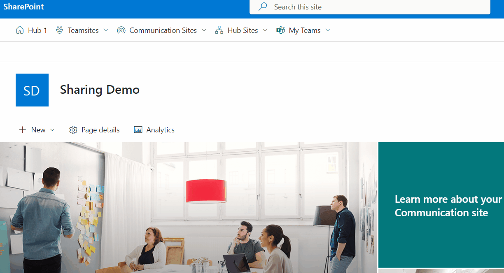

# Application Top Placeholder Navigation

## Summary

This is an SPFx extension acting as a Top placeholder. It uses a FluentUi CommandBar to display a search-driven navigation and diverse permission settings of artefacts in the current side on the right. It furthermore notifies if current site is enabled for external sharing or not.

Menu live in action inside a Communication site



For further details see the author's [blog post](https://mmsharepoint.wordpress.com/2023/07/27/a-search-driven-navigation-with-sharepoint-framework-spfx-extension-and-fluentui/)

## Used SharePoint Framework Version


## Applies to

- [SharePoint Framework](https://aka.ms/spfx)
- [Microsoft 365 tenant](https://docs.microsoft.com/en-us/sharepoint/dev/spfx/set-up-your-developer-tenant)

> Get your own free development tenant by subscribing to [Microsoft 365 developer program](http://aka.ms/o365devprogram)

## Version history

Version|Date|Author|Comments
-------|----|----|--------
0.1|Jul 27, 2023|[Markus Moeller](https://twitter.com/moeller2_0)|Initial release

## Disclaimer

**THIS CODE IS PROVIDED _AS IS_ WITHOUT WARRANTY OF ANY KIND, EITHER EXPRESS OR IMPLIED, INCLUDING ANY IMPLIED WARRANTIES OF FITNESS FOR A PARTICULAR PURPOSE, MERCHANTABILITY, OR NON-INFRINGEMENT.**

---

## Minimal Path to Awesome

- Clone this repository
- Ensure that you are at the solution folder
- in the command-line run:
  - **npm install**
  - **gulp serve --nobrowser**

- Open a SharePoint site of your choice
- Attach the following to your site url:
  ```
  ?loadSPFX=true&debugManifestsFile=https://localhost:4321/temp/manifests.js&customActions={"315298b1-ad03-4730-8423-0a07941a96d9":{"location":"ClientSideExtension.ApplicationCustomizer","properties":{"useTeamsites":true,"useCommsites": true,"useHubsites": true,"useTeams": true,"useGraph": true}}}
  ```
- Confirm 'Load Debug Scripts'
- Play around with the properties in above's url

## Features

* [Use the MSGraphClientV3 to connect to Microsoft Graph](https://learn.microsoft.com/en-us/sharepoint/dev/spfx/use-msgraph?WT.mc_id=M365-MVP-5004617)
  * [Use the Microsoft Search API to query data](https://learn.microsoft.com/en-us/graph/api/resources/search-api-overview?view=graph-rest-1.0&WT.mc_id=M365-MVP-5004617)
* [Use FluentUI CommandBar, ContextualMenu, Dialog, List, Panel, PersonaInitialsColor, Pivot, TextField](https://developer.microsoft.com/en-us/fluentui#/?WT.mc_id=M365-MVP-5004617)

## References

- [Getting started with SharePoint Framework](https://docs.microsoft.com/en-us/sharepoint/dev/spfx/set-up-your-developer-tenant)
- [Building for Microsoft teams](https://docs.microsoft.com/en-us/sharepoint/dev/spfx/build-for-teams-overview)
- [Use Microsoft Graph in your solution](https://docs.microsoft.com/en-us/sharepoint/dev/spfx/web-parts/get-started/using-microsoft-graph-apis)
- [Publish SharePoint Framework applications to the Marketplace](https://docs.microsoft.com/en-us/sharepoint/dev/spfx/publish-to-marketplace-overview)
- [Microsoft 365 Patterns and Practices](https://aka.ms/m365pnp) - Guidance, tooling, samples and open-source controls for your Microsoft 365 development
